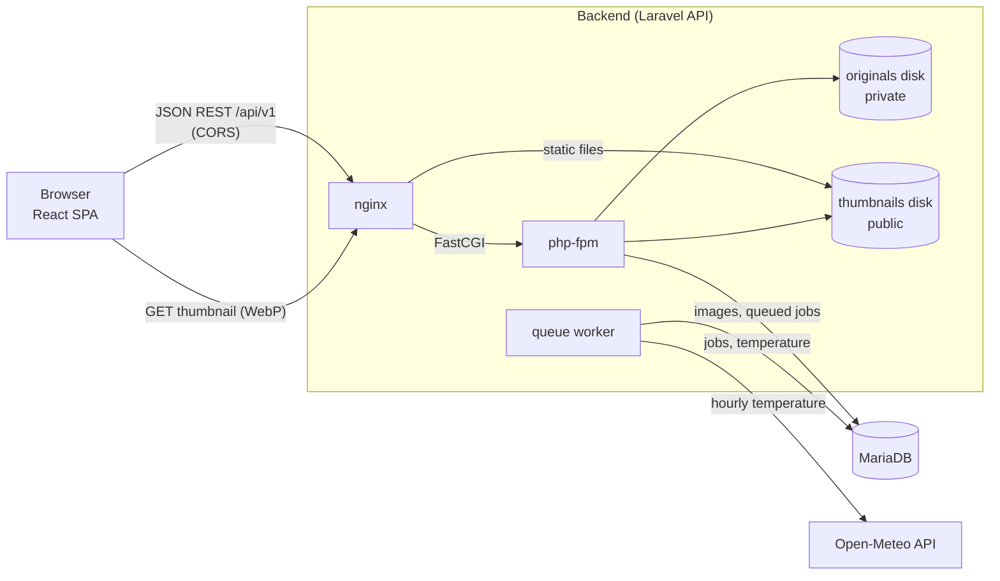
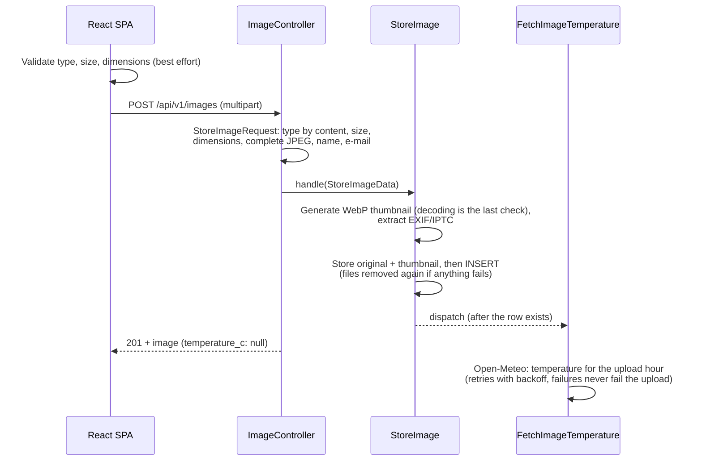

# Image Storage

A small web application for storing image files: upload JPG, PNG, WebP, TIFF or BMP images,
browse them in an infinitely scrolling list, download and delete them. Every upload gets a
server-generated WebP thumbnail, its raw EXIF/IPTC metadata and the air temperature in
Katowice at the time of upload.

The **backend** is a Laravel 13 JSON API (PHP 8.4, MariaDB, ImageMagick). The **frontend** is a
React + TypeScript single-page app. They share nothing but the REST contract and can be
deployed on separate servers.

- [Quick start](#quick-start)
- [Architecture](#architecture)
- [API](#api)
- [Testing and quality](#testing-and-quality)
- [Configuration and deployment](#configuration-and-deployment)
- [Key decisions](#key-decisions)
- [Future improvements](#future-improvements)
- [Troubleshooting](#troubleshooting)
- [License](#license)

## Features

- Upload with the uploader's name and e-mail. Types JPG, PNG, WebP, TIFF and BMP, at most 5 MB
  (5120 KiB), at least 500 × 500 px. The file is validated by its content, not its name.
- A list with thumbnail, extension, file size, resolution and uploader name, loaded 10 images at
  a time as you scroll.
- Download of the unchanged original under its original file name, and delete with
  confirmation.
- EXIF and IPTC metadata stored raw (as JSON) in the database, for every format: everything
  PHP's readers expose (see [Known limitations](#known-limitations)).
- The current air temperature in Katowice from [Open-Meteo](https://open-meteo.com/), fetched
  in the background for the hour of the upload.
- OpenAPI documentation of the API at <http://localhost:8000/docs/api>.

## Quick start

**Requirements:** Linux, macOS or Windows with WSL 2; Docker with Compose v2.24.4 or newer,
GNU Make and Bash. PHP, Composer and Node.js are not needed on the host: everything runs in
containers. Ports 8000, 5173 and 3306 must be free (and 8001, 5174 for the E2E suite).

```bash
git clone https://github.com/mtubis/image_storage.git
cd image_storage
make setup
```

`make setup` is meant for the first run, and it is safe to repeat. It:

1. installs the backend's Composer dependencies in a one-off `php` container, since the
   services need `backend/vendor` to start;
2. runs the database migrations in another one-off `php` container. On first run this also
   creates `backend/.env` from `.env.example` with a fresh app key;
3. builds and starts the stack and waits until it is up, including the `frontend` container's
   first `npm ci`.

The containers run as your user (UID/GID), so files they create in `backend/` and `frontend/`
stay yours.

Then open:

| URL | What |
|---|---|
| <http://localhost:5173> | The application (React SPA, Vite dev server) |
| <http://localhost:8000/api/v1/images> | The API |
| <http://localhost:8000/docs/api> | Interactive API documentation (OpenAPI) |

Afterwards, `make up` / `make down` start and stop the stack (the database is kept in a Docker
volume). `make logs` follows the containers' output, `make sh-php` opens a shell in the PHP
container, and `make artisan cmd="…"` runs an artisan command. The application log is
`backend/storage/logs/laravel.log`.

To run the tests (see [Testing and quality](#testing-and-quality)):

```bash
make check   # linters and unit/feature tests of both apps, as in CI
make e2e     # Playwright end-to-end suite on a separate stack
```

The first run of either pulls the Playwright image (about 2.5 GB unpacked) and installs
`e2e/node_modules`.

### Services

| Service | Image / role | Port |
|---|---|---|
| `nginx` | Serves the API and public thumbnails; upload limit 10 MB | 8000 |
| `php` | PHP 8.4-FPM with Imagick (ImageMagick 7.1), exif, pcntl | – |
| `queue` | The same image running `artisan queue:work` (temperature job) | – |
| `db` | MariaDB 11 | 127.0.0.1:3306 |
| `frontend` | Vite dev server | 5173 |

## Architecture



### Upload flow



### Backend (`backend/`)

| Layer | Where | Role |
|---|---|---|
| Controllers | `app/Http/Controllers/Api/V1` | Thin: FormRequest → Action → API Resource |
| Validation | `app/Http/Requests`, `app/Rules` | Type by content, dimensions, complete JPEG, safe text, cursors |
| Actions | `app/Actions/Images` | `StoreImage`, `DeleteImage`: one use case each, `handle()` |
| Contracts | `app/Contracts` | `ThumbnailGenerator`, `ImageMetadataExtractor`, `WeatherProvider` |
| Services | `app/Services/{Images,Weather}` | Imagick/Intervention thumbnails, ext-exif + IPTC extraction, Open-Meteo client, fake provider |
| DTOs | `app/Data` | `final readonly` value objects between layers |
| Job | `app/Jobs/FetchImageTemperature.php` | Queued temperature lookup with retries |
| Config | `config/images.php` | Single source of truth for upload limits, thumbnails and page size |

The originals live on a private disk and are reachable only through the download endpoint.
Thumbnails live on a public disk served by nginx. Images use ULID keys, so public IDs can't be
enumerated.

### Frontend (`frontend/`)

React 19, TypeScript (strict), Vite, TanStack Query, axios, react-hook-form + zod, CSS Modules.

```
src/
  api/                  axios client, zod schemas (the API contract), request functions
  features/images/
    components/         UploadForm, ImageList, ImageCard, DeleteImageButton
    hooks/              useImagesInfinite, useUploadImage, useDeleteImage
  lib/                  env parsing, query client, image dimension reader, helpers
  components/           app-wide layout
```

Server state is handled only by TanStack Query. Responses are parsed with zod at the boundary,
and the only configuration is `VITE_API_URL`.

## API

Base URL: `http://localhost:8000/api/v1`. JSON only, no authentication. The full specification
is in the [interactive documentation](http://localhost:8000/docs/api), and the raw OpenAPI
document is at `/docs/api.json`.

| Method | Path | Result |
|---|---|---|
| `GET` | `/images?cursor=…` | `200`: 10 images, newest first, cursor-paginated |
| `POST` | `/images` | `201`: the stored image. Multipart fields: `file`, `uploader_name`, `uploader_email` |
| `GET` | `/images/{id}/download` | `200`: the original as an attachment with its original file name |
| `DELETE` | `/images/{id}` | `204` |

An image in the API:

```json
{
  "id": "01m3c9c3tcps3ymbdjxhy8ffaz",
  "original_name": "scan.tiff",
  "extension": "tif",
  "mime_type": "image/tiff",
  "size_bytes": 1630,
  "width": 500,
  "height": 500,
  "thumbnail_url": "http://localhost:8000/storage/thumbnails/01m3c9c3tcps3ymbdjxhy8ffaz.webp",
  "download_url": "http://localhost:8000/api/v1/images/01m3c9c3tcps3ymbdjxhy8ffaz/download",
  "uploader_name": "Jan Kowalski",
  "temperature_c": 14.9,
  "created_at": "2026-09-25T12:41:48Z"
}
```

- `extension` and `mime_type` describe the **detected** type. `width`/`height` are the
  displayed dimensions: the EXIF orientation of a JPEG or TIFF is applied.
- `temperature_c` is `null` until the background job has run, or if the weather service stayed
  unavailable.
- The listing wraps images in `data`, and the next page's cursor is in `meta.next_cursor`
  (`null` on the last page).
- The uploader's e-mail is stored but **never returned** (PII), and neither is the metadata.

**Validation** (`422`, Laravel's standard `{"message", "errors": {field: [...]}}` body):

| Field | Rules |
|---|---|
| `file` | Required; JPG, PNG, WebP, TIFF or BMP **by content**; at most 5120 KiB; 500 × 500 to 10000 × 10000 px; a JPEG must not be truncated; metadata at most 8 MiB as JSON |
| `uploader_name` | Required; at most 100 characters; no control or bidirectional formatting characters |
| `uploader_email` | Required; RFC-valid e-mail; at most 255 characters |

**Errors** are always JSON:
- `404 {"message": "Not found."}` for an unknown image or route.
- `422` for an invalid cursor.
- `413` from nginx for bodies over 10 MB. Files between 5 and 10 MB get a `422` with a field
  error.

### Stored metadata

The `images.metadata` column holds the EXIF tags as decoded by ext-exif, grouped by section,
and the IPTC datasets from `iptcparse()`, in the same shape for every format. PNG and WebP
EXIF chunks are read too. Values are stored as read, not interpreted. Binary or non-UTF-8
values are wrapped as `{"base64": "…"}`, so the JSON stays valid without dropping bytes. An
excerpt:

```json
{
  "exif": {
    "IFD0": { "Make": { "base64": "Q2Fm6SBPcHRpY3M=" }, "Model": "FixtureCam 500", "Orientation": 6 },
    "EXIF": { "DateTimeOriginal": "2024:05:01 12:34:56", "ComponentsConfiguration": { "base64": "AQIDAA==" } }
  },
  "iptc": {
    "2#025": ["katowice", "fixture", "żółw"],
    "2#080": ["Jan Kowalski"]
  }
}
```

A file without metadata stores `NULL`. The per-format behaviour of PHP's readers is documented
and pinned in [`backend/tests/Fixtures/README.md`](backend/tests/Fixtures/README.md).

## Testing and quality

| Command | What it runs |
|---|---|
| `make check` | Everything below except E2E. Mirrors CI, so it must pass before a change is done |
| `make test-be` | Pest: unit, feature and arch tests on SQLite (in memory) |
| `make test-be-mariadb` | The same suite on MariaDB, the production engine |
| `make lint-be` | `composer validate`, Pint, Larastan (level max, strict rules, no baseline), Rector, Scramble spec analysis |
| `make test-fe` | Vitest + React Testing Library + MSW |
| `make lint-fe` / `make build-fe` | ESLint (type-aware), `tsc`, Prettier / production build |
| `make lint-e2e` | ESLint, `tsc` and Prettier for the Playwright suite |
| `make e2e` | Playwright against a separate, freshly seeded stack |
| `make fix` | Auto-fix formatting (Pint, Rector, ESLint, Prettier) |

- **Backend tests** use `Storage::fake`, `Http::fake` and `Queue::fake`, and real queue runs for
  the job. Stray HTTP requests fail the test, so no test reaches the network.
- **Uploads in tests are real image files** for every supported format (`backend/tests/Fixtures`),
  including a JPEG and a TIFF with EXIF + IPTC, invalid UTF-8 and binary values. They are
  generated by a script: `make fixtures` regenerates them.
- **Frontend tests** exercise behaviour through the DOM. MSW rejects unhandled requests.
- **E2E** (`e2e/`, Playwright, Chromium) covers upload, a rejected upload, infinite scroll,
  byte-exact download with a non-ASCII file name, delete, and the web server's size limits. It
  runs in its own Compose project (`image_storage_e2e`, ports 8001/5174, MariaDB on tmpfs) next
  to the development stack, with `WEATHER_PROVIDER=fake`, `QUEUE_CONNECTION=sync` and the
  production build of the frontend. The stack stays up for inspection afterwards: `make e2e-down`
  removes it and `make e2e-logs` prints its logs. Pass Playwright options with
  `make e2e args="--repeat-each=3"`.
  - The Playwright container uses host networking. On Docker Desktop (macOS/Windows), enable
    it under *Settings → Resources → Network*.
  - `make e2e` needs `backend/vendor`. After `make setup` it's there; in a clone used only for
    E2E, run `make e2e-deps` first.
- **CI** (GitHub Actions, `.github/workflows/ci.yml`) runs three jobs, on pushes to `main` and on
  pull requests:
  - backend: in the project's own PHP image, on SQLite and MariaDB;
  - frontend;
  - E2E: `make e2e`, with the Playwright report and traces uploaded on failure.

## Configuration and deployment

The development stack takes its settings from `docker-compose.yml`, so nothing needs editing.
For a deployment on separate servers:

**Backend** (PHP 8.4 with `imagick`, `exif`, `intl`, `pdo_mysql`, `pcntl`; ImageMagick 7).
`docker/php/Dockerfile`, `docker/php/php.ini` and `docker/nginx/templates/default.conf.template`
are the reference configuration: upload limits, the JSON `413`, and caching headers for
thumbnails.

| Variable | Purpose |
|---|---|
| `APP_KEY`, `APP_ENV=production`, `APP_DEBUG=false` | Laravel's usual production settings |
| `APP_URL` | Public URL of the API; used for the absolute `thumbnail_url` / `download_url` |
| `FRONTEND_URL` | The only origin allowed by CORS (also used by nginx for its own `413` response) |
| `DB_CONNECTION=mariadb`, `DB_*` | Database |
| `QUEUE_CONNECTION` | `database` (a `queue:work` process must run) or `sync` |
| `WEATHER_PROVIDER` | `open-meteo` (default) or `fake` (no network, fixed value) |

- Upload limits, thumbnail size, ImageMagick resource limits and page size are in
  `backend/config/images.php`. The Open-Meteo URL, coordinates and timeouts are in
  `backend/config/services.php`.
- PHP's `upload_max_filesize` / `post_max_size` and the web server's body limit must be above
  5 MB (10 MB here), so an oversized file gets a validation error rather than a bare `413`.
- On each deploy:
  - `composer install --no-dev --optimize-autoloader`;
  - `php artisan migrate --force`, `php artisan config:cache`;
  - `php artisan storage:link` (first deploy), so thumbnails are served from `public/storage`;
  - `php artisan queue:restart`, so the supervised `queue:work` process picks up the new code;
  - `php artisan scramble:cache` to cache the API documentation, which is otherwise generated
    on each request (or `scramble:clear`, to keep generating it).

**Frontend** (Node.js 22): `npm ci`, then `VITE_API_URL=https://api.example.com/api/v1 npm run
build`, and serve `dist/` as static files. The URL is validated when the app starts.

## Key decisions

Details and reasoning: **[docs/DECISIONS.md](docs/DECISIONS.md)**.

- **Type validated by content** (finfo), not by the file name. The stored extension and MIME
  type are the detected ones.
- **An upper limit of 10000 × 10000 px and ImageMagick resource limits** guard against
  decompression bombs, which fit easily into 5 MB. Truncated JPEGs, which libjpeg would silently
  render grey, are rejected.
- **WebP thumbnails from Imagick** for every format, because browsers can't show TIFF. Only the
  first page is decoded, then downscaled natively, oriented from EXIF and stripped of metadata.
- **Metadata** keeps one `{exif, iptc}` shape for all formats. PNG/WebP EXIF chunks are read by
  a small bounds-checked reader. Binary values are base64-wrapped, and the JSON size is capped
  below MariaDB's packet limit.
- **Temperature in a queued job** for the upload's hour, not the job's. It is matched using
  Open-Meteo's own UTC offset (correct on DST change days) and retried only on transient errors.
  A weather failure never fails an upload.
- **Files and database stay consistent**: files are written first and removed if the INSERT
  fails. On delete, the row goes first and the files after commit.
- **Cursor pagination** with a composite `(created_at, id)` index gives a stable infinite
  scroll. Cursors that don't have the listing's shape (keys and value types) are rejected.
- **Downloads** use a `Content-Disposition` header built in-house: a UTF-8 `filename*` plus an
  ASCII fallback, and the detected extension appended when the name doesn't match it.
- **Privacy and exposure**: the e-mail is never returned, originals are private, CORS allows a
  single origin, and every 404 is generic.
- **Frontend**: server state lives in TanStack Query, API responses are parsed with zod, client
  checks are never stricter than the server's, and focus and accessibility are handled.
- **Tests use real image fixtures**, never `UploadedFile::fake()`, which trusts the file name.
  The suite also runs on MariaDB, and E2E runs against the production build.

### Known limitations

- Metadata is what PHP's readers expose:
  - a `MakerNote` of a vendor ext-exif doesn't know is stored as `null`;
  - only the first JPEG `APP13` segment is read;
  - IPTC is read from JPEG and TIFF only;
  - XMP is not extracted;
  - the metadata extractor doesn't read pages 3+ of a multi-page TIFF.
- CMYK images are converted to RGB without colour management (thumbnails only).
- A job retry after Warsaw midnight stores `null` (`forecast_days=1` is prescribed).
- E2E runs in Chromium only.

See [docs/DECISIONS.md](docs/DECISIONS.md#known-limitations).

## Future improvements

- **Authentication and authorization.** Uploads tied to users, and permissions for download and
  delete.
- **S3-compatible object storage** for originals, with pre-signed download URLs and thumbnails
  behind a CDN. The Filesystem abstraction already isolates storage.
- **Rate limiting** of uploads and downloads per client.
- **Malware scanning** (e.g. ClamAV) of uploads before they are stored or served.
- **Duplicate detection** by content hash (exact) or perceptual hash (near-duplicates).
- **Metadata search**: normalised, indexed fields (camera, date taken, GPS, IPTC keywords)
  extracted from the raw JSON.
- **Chunked / resumable uploads** (e.g. tus) for larger files and unreliable networks.
- **Colour-managed CMYK → sRGB conversion** with an ICC profile, and **XMP extraction**.
- **Thumbnail generation in a queue**, with several sizes and `srcset`, if uploads get larger.
- **A cleanup command for orphaned files** left by failed deletions, and **ImageMagick time
  limits** after load testing.
- **E2E in Firefox and WebKit**, visual regression tests.

## Troubleshooting

- **`502 Bad Gateway` after rebuilding only the `php` service**: nginx resolves `php` once at
  start. Run `docker compose restart nginx`.
- **nginx's HTML `404` for every API URL after a restart of Docker Desktop or WSL**: the
  containers started before the project directory was available, so their bind mounts are
  empty (`php artisan` reports "Could not open input file"). Recreate them with
  `make down && make up`; `make up` alone keeps the running containers.
- **A port is already in use**: stop whatever uses 8000, 5173 or 3306, or change the host port
  in a `docker-compose.override.yml`. `VITE_API_URL`, `APP_URL` and `FRONTEND_URL` (set for
  both `php` and `nginx`) must then match.
- **Files in `backend/` or `frontend/` owned by root**: the containers run as your UID/GID only
  when started through the Makefile, which passes `DOCKER_UID`/`DOCKER_GID`. Use `make` targets
  rather than plain `docker compose up`.
- **The temperature stays `null`**: a failed lookup is logged as a warning with the image ID in
  `backend/storage/logs/laravel.log`. `make logs` shows whether the `queue` worker runs the jobs.

## License

[MIT](LICENSE).
